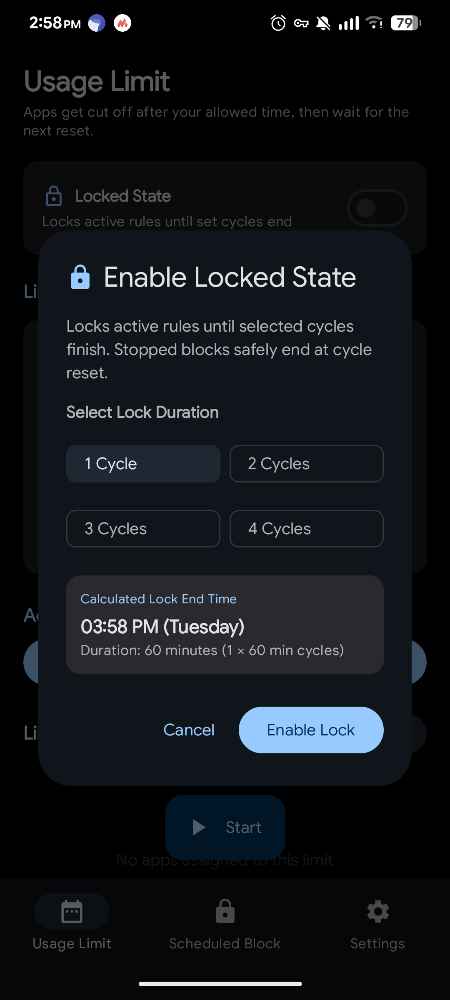
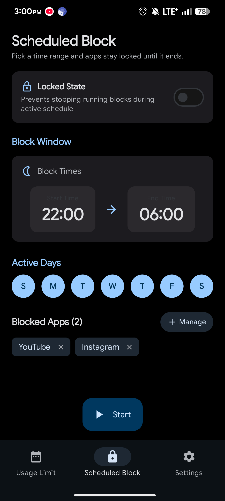
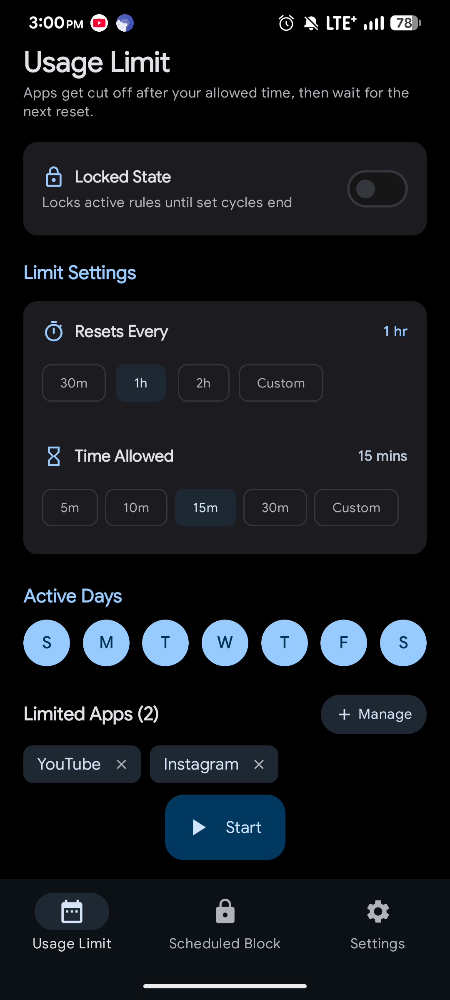
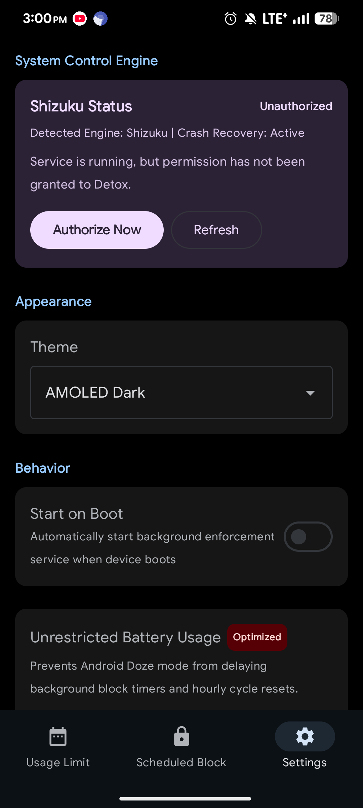

# HardStop

<p align="center">
  
  
  
  
</p>

<p align="center">
  
  
  
  
</p>

HardStop is a system-level Android digital wellbeing app that enforces true app suspension. Powered by **[Shizuku](https://shizuku.rikka.app/)**, it disables distracting apps at the OS level based on custom enforcement rules—no easily bypassable overlays.

---

## ✨ Key Features

* **⏱️ Usage Limit Rules:** Limit app usage within rolling windows (e.g., 30 mins every 3 hours). Apps remain locked until the cycle resets.
* **🌙 Scheduled Block Rules:** Schedule complete block windows for fixed timeframes (e.g., 11 PM–7 AM).
* **🔒 True OS Suspension:** Uses Shizuku to execute `setPackagesSuspended`. Suspended apps cannot be launched from any launcher.
* **🎯 Per-App Precision:** Tracks exact individual app usage cycles without timer drift or premature resets.
* **🔄 Boot Recovery:** Automatically re-evaluates rules and restores active suspensions after a device restart.

---

## ⚙️ How It Works

1. **Tracking:** `DetoxTimerService` computes foreground usage using `UsageStatsManager`.
2. **Enforcement:** Exceeding an allowance triggers `ShizukuPackageEngine` to suspend the package.
3. **Scheduling:** `AlarmManager` schedules exact cycle reset events to eliminate constant background polling.

---

## 📋 Requirements

* **OS:** Android 8.0 (API 26) or higher
* **Permissions:** Usage Access (`PACKAGE_USAGE_STATS`)
* **Engine:** [Shizuku](https://shizuku.rikka.app/) running via Wireless ADB or Root
  * *Recommended:* [thedjchi/Shizuku](https://github.com/thedjchi/Shizuku) fork for enhanced stability on newer Android versions.

---

## 🚀 Quick Setup

1. Start **Shizuku** via Wireless ADB or Root.
2. Open **HardStop** and grant **Usage Access** and **Shizuku** permissions when prompted.
3. Define your **Usage Limit** or **Scheduled Block** rules and select target applications.
4. Set HardStop battery optimization to **Unrestricted** (*Settings → Apps → HardStop → Battery*) to ensure background alarms execute on time (refer to [dontkillmyapp.com](https://dontkillmyapp.com/)).

---

## 🤝 Contributing

HardStop is my first Android project! Contributions, feedback, and bug reports are welcome! Please include logcat output when reporting timing issues:


```bash
adb logcat --pid=$(pidof com.example.detox)
```


## 📄 License


Distributed under the **MIT License**. See [LICENSE](https://www.google.com/search?q=LICENSE) for details. 
