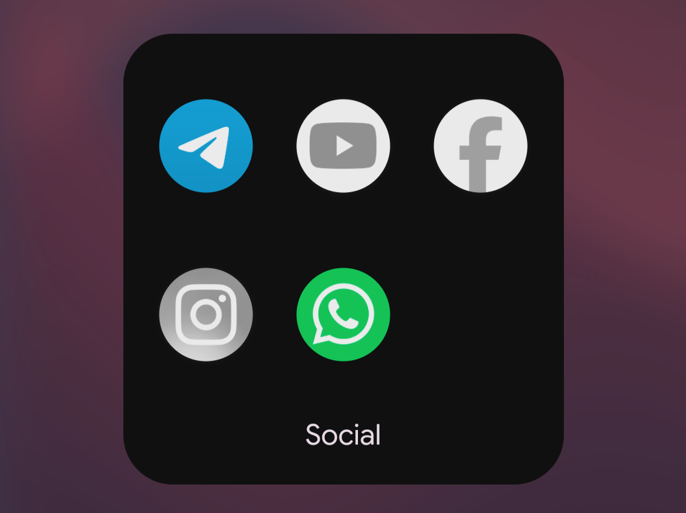

# HardStop

  

A digital wellbeing app for Android that enforces real app suspension, not just reminders. HardStop uses [Shizuku](https://github.com/RikkaApps/Shizuku) to actually suspend distracting apps at the system level, based on rules you define.

## Features

- **Pace Rules** — Allow an app a fixed amount of usage (e.g. 30 minutes) within a rolling cycle (e.g. every 3 hours). Once the allowance is used up, the app is suspended until the cycle resets.
- **Freeze Rules** — Automatically suspend selected apps during a configured time window (e.g. 11 PM–7 AM).
- **Real app suspension, not just blocking overlays** — Uses Shizuku to call system-level `setPackagesSuspended`, so blocked apps can't be launched at all, rather than relying on an accessibility overlay that can be dismissed.
- **Start on boot** — Rule monitoring and active suspensions are restored automatically after a device restart.
- **Per-app cycle tracking** — Each app tracks its own precise cycle start time, so partial usage (e.g. 20 of 30 minutes) is preserved accurately until that app's cycle actually ends — no drifting or premature resets.

## How it works

1. You define one or more **Pace Rules** (allowance + window period) and/or a **Freeze Rule** (block window period) and select which installed apps they apply to.
2. `DetoxTimerService` evaluates these rules using Android's `UsageStatsManager` events, computing exact foreground time per app within its current cycle.
3. When an app exceeds its allowance, HardStop calls into `ShizukuPackageEngine` to suspend the package via Shizuku's elevated permissions.
4. An `AlarmManager` alarm is scheduled for the next meaningful event (cycle expiry, block expiry) so the app can react precisely without constant polling.
5. Suspended apps are automatically released the moment their cycle resets.

## Requirements

- Android 8.0 (API 26) or higher
- [Shizuku](https://shizuku.rikka.app/) installed and running (via ADB pairing or a rooted device)
- Usage Access permission (`PACKAGE_USAGE_STATS`) granted to HardStop

### Recommended Shizuku version

For newer Android versions (beyond Android 16 QPR1), the original Shizuku repository may occasionally crash. It's recommended to use an active fork for better compatibility, stability:

- **Recommended fork:** [thedjchi/Shizuku](https://github.com/thedjchi/Shizuku)

The original Shizuku or other community forks will also work, but this fork handles newer Android API changes more smoothly.

## Setup

1. Install and start [Shizuku](https://github.com/thedjchi/Shizuku) (wireless or ADB debugging works fine on unrooted devices).
2. Install HardStop, grant it **Usage Access** and Shizuku permission when prompted.
3. Configure your **Hourly Limit** and/or **Night Block** rules and pick the apps to restrict.
4. Set HardStop's battery usage to **Unrestricted** (Settings → Apps → HardStop → Battery) so cycle resets and unblocks stay reliable in the background. On Samsung/Xiaomi/OnePlus, check [dontkillmyapp.com](https://dontkillmyapp.com/) too — their battery managers can still kill background apps regardless.

## Contributing

This is my first Android app, feedback, corrections, issues and PRs welcome. Please include logcat output (`adb logcat --pid=$(pidof com.example.detox)`) when reporting rule-timing bugs — cycle behavior is timestamp-sensitive and hard to diagnose without it.

## License

Distributed under the MIT License. See [LICENSE](LICENSE) for more information.
