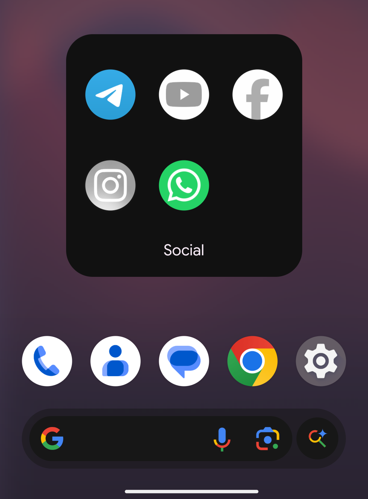

# HardStop

  

  
  
  
  

A digital wellbeing app for Android that enforces real app suspension - not reminders, not overlays. HardStop uses [Shizuku](https://github.com/RikkaApps/Shizuku) to suspend distracting apps at the system level, based on rules you set and can optionally lock yourself into.

## Screenshots

  
  
  
  

## Features

- **Usage Limit** - Fixed allowance per app within a repeating cycle. Once used up, the app is suspended until the cycle resets.
- **Scheduled Block** - Suspend apps during a fixed daily time window, with per-day scheduling.
- **Locked State** - Commitment mode: once enabled, blocks can't be stopped early - only after your chosen number of cycles finishes.
- **Real suspension, not a dismissible overlay** - Uses Shizuku's `setPackagesSuspended` API, so blocked apps genuinely can't be opened.

  

- **No accessibility service** - runs on Shizuku alone, so less battery/RAM use.
- **Crash-resilient & reboot-safe** - Runs via ADB with a retry queue, and restores rules automatically after a restart.
- **Accurate cycle tracking** - Each app's usage cycle is tracked independently, so partial usage is preserved rather than reset early.

## How it works

1. Set up a Usage Limit and/or Scheduled Block, pick active days, and assign apps.
2. The background service tracks foreground time via `UsageStatsManager` and checks it against your rules.
3. When triggered, `ShizukuPackageEngine` suspends the relevant apps through Shizuku.
4. `AlarmManager` schedules the next relevant event (cycle reset, block end) instead of polling.
5. Apps release automatically when the cycle/block ends - unless Locked State is active, in which case they stay locked until it expires.

## Requirements

- Android 8.0 (API 26) or higher
- [Shizuku](https://shizuku.rikka.app/) installed and running (ADB pairing works fine on unrooted devices)
- Usage Access permission (`PACKAGE_USAGE_STATS`) granted to Aegis Detox

### Recommended Shizuku version

On Android 16 QPR1+, the original Shizuku app can occasionally crash. This fork is more stable on newer API levels:

- [thedjchi/Shizuku](https://github.com/thedjchi/Shizuku)

## Setup

1. Install and start [Shizuku](https://github.com/thedjchi/Shizuku).
2. Download HardStop from [Release page](https://github.com/Daminduharsha11/HardStop/releases/latest)
3. Install HardStop, grant Usage Access and authorize Shizuku when prompted.
4. Set up your rules and assign apps.
5. Set battery usage to **Unrestricted** (Settings → Apps → Aegis Detox → Battery) so cycle resets aren't killed in the background. On Samsung/Xiaomi/OnePlus, also check [dontkillmyapp.com](https://dontkillmyapp.com/).

## Contributing

This is my first Android project. Feedback, issues, and PRs welcome. For rule-timing bugs, please include logcat output (`adb logcat --pid=$(pidof com.aegis.hardstop)`) cycle behavior is timestamp-sensitive and hard to diagnose blind.

## License

Distributed under the MIT License. See [LICENSE](LICENSE) for details.
